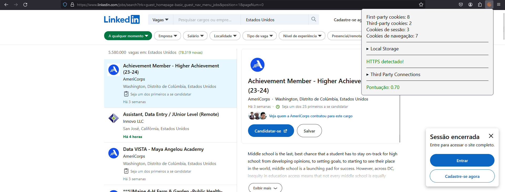

# James Sceurity - Firefox Extension

James Security is a powerful Firefox extension that unveils the secrets hidden within the websites you visit. It provides a comprehensive analysis of cookies, localStorage usage, HTTPS security, and generates an overall score for each website.

## Features

- 🍪 Cookie Detection: Detects and categorizes cookies used by the webpage into four categories: first-party, third-party, session, and navigation cookies.
- 🗃️ localStorage Analysis: Displays the contents and storage usage of the localStorage for the current website.
- 🔒 HTTPS Indicator: Indicates whether the website is served over a secure HTTPS connection.
- 🎯 Overall Website Score: Generates an overall score for the website based on the partial scores of the above features.
nal website score to assess its privacy and security practices.

## Screenshots

## Development

To set up the development environment and contribute to James Security, follow these steps:

1. Clone this repository: `git clone https://github.com/jamessonlps/security-detector-extension.git`
2. Navigate to the project directory: `cd security-detector-extension`
3. Install dependencies: `npm install`
4. Build the extension: `npm run build`
5. Load the extension in Firefox for testing:
   - Open Firefox and visit `about:debugging`
   - Click on "This Firefox" in the sidebar.
   - Click on "Load Temporary Add-on".
   - Select the `manifest.json` file in the `dist` folder.
6. Make your desired changes and test the extension in the browser.
7. Submit a pull request with your improvements.

## Credits

James Security is developed and maintained by [Jamesson Leandro](https://github.com/jamessonlps).

## License

This project is licensed under the [MIT License](./LICENSE).

---

Let James Security be your guide in uncovering the mysteries of website cookies and privacy practices. Enjoy a safer and more informed browsing experience with this powerful Firefox extension. Happy investigating!

<a href="https://www.flaticon.com/br/icones-gratis/biscoito" title="biscoito ícones">Biscoito ícones criados por Freepik - Flaticon</a>